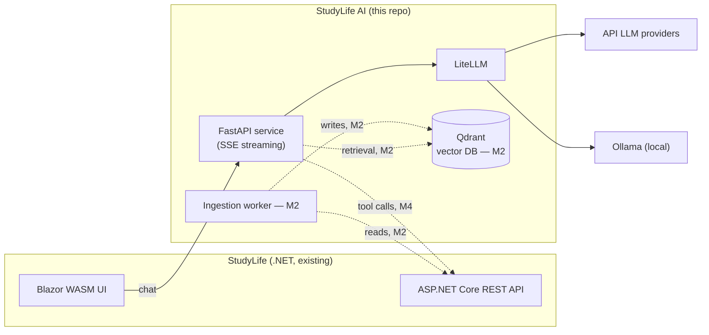

# StudyLife AI

[](https://github.com/lukislp/studylife-ai/actions/workflows/ci.yml)
[](LICENSE)
[](https://www.python.org/)

A standalone Python microservice that adds an LLM agent to [StudyLife](https://github.com/lukislp/studylife) (Blazor WASM + ASP.NET Core, .NET 10), a self-hosted study platform. It will provide:

- **Study Assistant (RAG)** — answer questions about notes, courses, and calendar data, with citations back to the source note.
- **Study Plan Generator** — turn exam dates, ECTS targets, and availability into a weekly plan.
- **Agent Actions (function calling)** — create sessions, start timers, summarize notes via the existing StudyLife REST API. Write actions always go through a confirmation flow.
- **Evaluation** — a RAGAS-based eval pipeline (faithfulness, answer relevancy, context precision) running in CI.

This is a learning project and portfolio piece; design decisions and trade-offs are logged in [docs/decisions.md](docs/decisions.md).

## Status: M2 in progress

M1 (scaffold, `/health`, streaming `/chat`) is done. M2 ingestion is built: a client-side diff against Qdrant decides what's new/changed/deleted in StudyLife's notes, changed notes are chunked, embedded, and upserted (see [Usage → Ingestion](#ingestion)). RAG retrieval is not wired into `/chat` yet — that's the next step, pending the retrieval-design decision logged in [docs/decisions.md](docs/decisions.md). See [Roadmap](#roadmap).

## Architecture



Dotted edges are not built yet (see roadmap).

## Quickstart

```bash
cp .env.example .env
docker compose up --build
```

This starts the FastAPI service, Qdrant, and Ollama. To use the default local model:

```bash
docker compose exec ollama ollama pull llama3.2
```

No GPU, or the local model is too slow? Skip Ollama and point `/chat` at an API provider instead: set `LLM_MODEL=openai/gpt-4o-mini` and `OPENAI_API_KEY=sk-...` in `.env` (leave `LLM_API_BASE` empty).

Then check the service is up:

```bash
curl http://localhost:8000/health
curl -N -X POST http://localhost:8000/chat \
  -H "Content-Type: application/json" \
  -d '{"messages": [{"role": "user", "content": "Hi"}]}'
```

### Local development (without Docker)

```bash
uv sync
uv run uvicorn studylife_ai.main:app --reload
uv run pytest
uv run ruff check .
uv run mypy src
```

## Configuration

All variables are read from the environment / `.env` (see [`.env.example`](.env.example)).

| Variable                       | Default                   | Description                                                                 |
| ------------------------------- | -------------------------- | ----------------------------------------------------------------------------- |
| `APP_NAME`                     | `StudyLife AI`            | Display name used in the FastAPI app metadata.                              |
| `ENVIRONMENT`                  | `local`                   | One of `local`, `staging`, `production`.                                    |
| `LOG_LEVEL`                    | `INFO`                    | Python logging level.                                                       |
| `LLM_MODEL`                    | `ollama/llama3.2`         | LiteLLM model identifier; selects provider and model, e.g. `openai/gpt-4o-mini`. |
| `LLM_API_BASE`                 | `http://localhost:11434`  | Base URL for self-hosted model backends (e.g. Ollama). Unused for most API providers. |
| `LLM_REQUEST_TIMEOUT_SECONDS`  | `60`                      | Timeout for LLM requests.                                                   |
| `OPENAI_API_KEY` / provider keys | _(unset)_                | Read directly by LiteLLM based on the `LLM_MODEL` provider prefix — not modeled by this app. |
| `STUDYLIFE_API_BASE_URL`       | _(unset)_                 | Base URL of your StudyLife instance, e.g. `http://localhost:8080`. Required for ingestion. |
| `STUDYLIFE_API_KEY`            | _(unset)_                 | StudyLife's non-interactive API key (Settings → API key for integrations, after a passkey login). Required for ingestion. |
| `STUDYLIFE_USER_ID`            | `primary`                 | Arbitrary label stored on ingested chunks, not a StudyLife-internal ID — see [docs/decisions.md](docs/decisions.md). |
| `EMBEDDING_MODEL`              | `ollama/nomic-embed-text` | LiteLLM embedding model identifier, same provider convention as `LLM_MODEL`. |
| `QDRANT_URL`                   | `http://localhost:6333`  | Qdrant connection URL.                                                      |
| `QDRANT_COLLECTION`            | `studylife_notes`        | Qdrant collection name for note chunks.                                     |
| `CHUNK_SIZE_TOKENS`            | `500`                     | Target chunk size in tokens (measured via `tiktoken`, provider-independent approximation). |
| `CHUNK_OVERLAP_TOKENS`         | `75`                      | Overlap between consecutive chunks, in tokens.                              |

## API

- `GET /health` — liveness check.
- `POST /chat` — streams an LLM completion as Server-Sent Events. Request body: `{"messages": [{"role": "user", "content": "..."}], "model": "optional-override"}`. Each event is `data: {"delta": "..."}`; the stream ends with `data: [DONE]`.

## Ingestion

Syncs StudyLife notes into Qdrant: fetches all notes, diffs them against what's already stored (by content hash, not a StudyLife-side timestamp — see [docs/decisions.md](docs/decisions.md)), then chunks, embeds, and upserts what's new or changed, and removes what's gone. Requires `STUDYLIFE_API_BASE_URL` and `STUDYLIFE_API_KEY` to be set.

```bash
# via docker compose (uses the running app container's environment)
docker compose exec app python -m studylife_ai.ingestion

# local dev
uv run python -m studylife_ai.ingestion
```

There's no scheduler yet — run it manually or via your own cron for now; recurring sync is a deployment concern for a later milestone.

## Evaluation

No eval pipeline yet — planned for M3 (RAGAS + a versioned eval set). Results will be published here once measured; no numbers are fabricated in the meantime.

## Roadmap

- [x] **M1** — Repo scaffold: FastAPI service with `/health` and streaming `/chat` (LiteLLM, no RAG), Docker + Compose, CI (lint + tests), README v1.
- [ ] **M2** — Ingestion pipeline + Qdrant + RAG v1 with source citations.
- [ ] **M3** — Eval set + RAGAS in CI, baseline metrics.
- [ ] **M4** — LangGraph agent + tools against the StudyLife API, confirmation flow for write actions.
- [ ] **M5** — k3s deployment, rate limiting, cost/latency logging, Ollama option.
- [ ] **M6** — Documentation polish, architecture diagram, demo material.

## Tech stack

| Component      | Technology                                                    |
| --------------- | --------------------------------------------------------------- |
| Service        | Python 3.12, FastAPI, SSE streaming                           |
| Agent framework | LangGraph (from M4)                                            |
| LLM             | Provider-agnostic via LiteLLM; API models + local via Ollama   |
| Vector DB       | Qdrant (from M2)                                                |
| Ingestion       | Python worker reading from the StudyLife REST API (from M2)    |
| Evaluation      | RAGAS + a versioned eval set (from M3)                         |
| Deployment      | Docker, k3s manifests, GitHub Actions CI                       |
| Frontend        | Blazor WASM chat component in the StudyLife repo (separate step) |

## License

[AGPL-3.0](LICENSE), matching the main [StudyLife](https://github.com/lukislp/studylife) repository.
