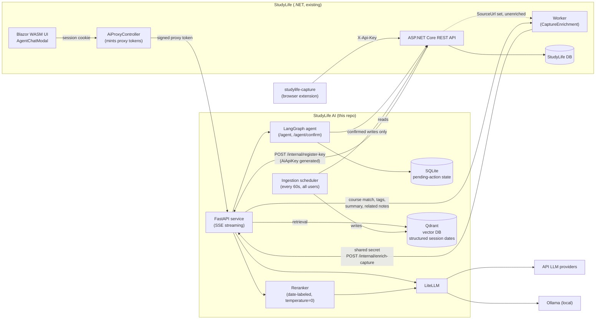

# StudyLife AI

[](https://github.com/lukislp/studylife-ai/actions/workflows/ci.yml)
[](https://github.com/lukislp/studylife-ai/releases)
[](LICENSE)
[](https://www.python.org/)

A standalone Python microservice that adds an LLM agent to [StudyLife](https://github.com/lukislp/studylife) (Blazor WASM + ASP.NET Core, .NET 10), a self-hosted study platform. It provides:

- **Study Assistant (RAG)** — answer questions about notes, courses, and calendar data, with citations back to the source.
- **Study Plan Generator** — turn exam dates, ECTS targets, and availability into a weekly plan.
- **Agent Actions (function calling)** — create sessions and summarize+save notes via the existing StudyLife REST API. Write actions always go through a confirmation flow (see [Agent](#agent)).
- **Capture enrichment** — course matching, tags, a summary, and related-notes suggestions for notes saved via the [studylife-capture](https://github.com/lukislp/studylife-capture) browser extension (see [Capture enrichment](#capture-enrichment)).
- **Evaluation** — a RAGAS-based eval pipeline (faithfulness, answer relevancy, context precision) running in CI.

This is a learning project and portfolio piece; design decisions and trade-offs are logged in [docs/decisions.md](docs/decisions.md).

## Status: M1–M6 done

M1 (scaffold, `/health`, streaming `/chat`), M2 (ingestion + Qdrant + RAG v1 with source citations, see [Ingestion](#ingestion)), and M3 (RAGAS eval in CI, see [Evaluation](#evaluation)) are done. M4 is done: a LangGraph agent can create study sessions and summarize+save notes via `POST /agent`, with every write gated behind an explicit confirmation step (`POST /agent/confirm`) — see [Agent](#agent). M4.5 (multi-user support) is done: identity is a short-lived, HMAC-signed proxy token minted by StudyLife's backend (not the long-lived `AiApiKey` - StudyLife only ever stores a hash of that, never the plaintext, so it can't be forwarded), verified purely locally on this side; per-user Qdrant partitioning, multi-user ingestion, and a `RegisteredKeyStore` populated automatically by StudyLife when a user generates their `AiApiKey` round out the design. The StudyLife-side proxy endpoint (`AiProxyController`) and registration wiring are built and live-verified end-to-end against a real session. M5 is done: cost/latency logging for every LLM call (see [Observability](#observability)), the local Ollama path re-verified live after M4/M4.5's changes, and k3s manifests + a second Flux GitOps source in the StudyLife repo (see [Deployment](#deployment)). Rate limiting was deliberately deferred out of this milestone, not dropped, and has since been added (see [API](#api) and [docs/decisions.md](docs/decisions.md) "Rate limiting"). The Blazor chat/agent UI (`AgentChatModal.razor` in the StudyLife repo, opened from the FAB speed dial) is done and live-verified extensively against production. M6 (docs polish, architecture diagram, demo material) is done — see the walkthrough at [docs/demo.md](docs/demo.md) and the diagram below.

**Post-M5 production hardening**, all found and fixed via live testing against the real deployment, not assumed: an in-process scheduler now re-syncs every registered account every 60s (content changed via the agent or directly in StudyLife used to only reach `/chat` after a one-time or manually-triggered sync); sessions gained a real structured date field in Qdrant with a genuine range filter, replacing an approach that handed an LLM reranker the user's entire session history and asked it to read dates out of free text - that approach worked for "today" but degraded on less obvious offsets, one round even producing a fabricated session; the reranker itself moved from an unpinned-temperature `gpt-4o-mini` call to a temperature-0 `gpt-4o` call once direct testing (`kubectl exec` into the live pod, real query, real data) showed the smaller model truncating its ranking output on pools above ~40 candidates; the agent gained a system prompt (it had none beyond a date message) after silently guessing between two similarly-named real courses instead of asking; and `RETRIEVAL_TOP_K` was raised after a CI eval regression traced to four content types competing for a fixed final cut. Full writeups with the live evidence for each: [docs/decisions.md](docs/decisions.md).

**Capture enrichment** (2026-08-21, see [Capture enrichment](#capture-enrichment)): a new `POST /internal/enrich-capture` endpoint backs the [studylife-capture](https://github.com/lukislp/studylife-capture) browser extension — course matching (scoped to the user's active courses, with a note/session fallback once a direct-embedding match against a real capture proved unreliable on its own, 0.44 vs. a 0.75 threshold in the case that surfaced it), tags, a one-sentence summary, related-notes suggestions, and immediate Qdrant indexing. Found and fixed live in production: a `NetworkPolicy` gap that silently dropped every call from StudyLife's background worker specifically (invisible in this service's own logs, since the request never arrived) — see [docs/decisions.md](docs/decisions.md) "Capture enrichment".

## Architecture



`AiProxyController` mints a short-lived, HMAC-signed proxy token identifying the logged-in user without ever needing their `AiApiKey` (which StudyLife only ever stores a hash of, never the plaintext, so it can't be forwarded) — see [docs/decisions.md](docs/decisions.md) "M4.5 Multi-user support". The ingestion scheduler replaced a one-shot/manual-only sync: it re-syncs every registered account on a fixed interval so content changed via the agent or directly in StudyLife shows up in `/chat` within about a minute — see [Ingestion](#ingestion) and "Periodic ingestion sync". Capture enrichment (`/internal/enrich-capture`, see [Capture enrichment](#capture-enrichment)) reuses the same shared-secret trust boundary as `register-key`/`revoke-key`, not the per-request proxy token — it's called from StudyLife's own backend, asynchronously and well after any live user session, so there's no per-request token to mint from.

## Quickstart

```bash
cp .env.example .env
docker compose up --build
```

This starts the FastAPI service, Qdrant, and Ollama. To use the default local model:

```bash
docker compose exec ollama ollama pull llama3.2
```

No GPU, or the local model is too slow? Skip Ollama and point `/chat` at an API provider instead: set `LLM_MODEL=openai/gpt-4o-mini` and `OPENAI_API_KEY=sk-...` in `.env` (leave `LLM_API_BASE` empty).

Then check the service is up:

```bash
curl http://localhost:8000/health
curl -N -X POST http://localhost:8000/chat \
  -H "Content-Type: application/json" \
  -d '{"messages": [{"role": "user", "content": "Hi"}]}'
```

### Local development (without Docker)

```bash
uv sync
uv run uvicorn studylife_ai.main:app --reload
uv run pytest
uv run ruff check .
uv run mypy src
```

## Configuration

All variables are read from the environment / `.env` (see [`.env.example`](.env.example)).

| Variable                       | Default                   | Description                                                                 |
| ------------------------------- | -------------------------- | ----------------------------------------------------------------------------- |
| `APP_NAME`                     | `StudyLife AI`            | Display name used in the FastAPI app metadata.                              |
| `ENVIRONMENT`                  | `local`                   | One of `local`, `staging`, `production`.                                    |
| `LOG_LEVEL`                    | `INFO`                    | Python logging level.                                                       |
| `LLM_MODEL`                    | `ollama/llama3.2`         | LiteLLM model identifier; selects provider and model, e.g. `openai/gpt-4o-mini`. |
| `LLM_API_BASE`                 | `http://localhost:11434`  | Base URL for self-hosted model backends (e.g. Ollama). Unused for most API providers. |
| `LLM_REASONING_EFFORT`         | _(unset)_                 | Only for reasoning models (e.g. OpenAI's `gpt-5` family) — `minimal`/`low`/`medium`/`high`. Unset = omitted, correct for non-reasoning models. See [docs/decisions.md](docs/decisions.md). |
| `LLM_REQUEST_TIMEOUT_SECONDS`  | `60`                      | Timeout for LLM requests.                                                   |
| `ALLOWED_CHAT_MODELS`          | _(unset)_                 | Audit F15: comma-separated LiteLLM model strings `POST /chat`'s optional `model` override may name, in addition to `LLM_MODEL` itself (always implicitly allowed). Unset = only `LLM_MODEL` — a request naming anything else gets `400`. See [API](#api). |
| `OPENAI_API_KEY` / provider keys | _(unset)_                | Read directly by LiteLLM based on the `LLM_MODEL` provider prefix — not modeled by this app. |
| `STUDYLIFE_API_BASE_URL`       | _(unset)_                 | Base URL of your StudyLife instance, e.g. `http://localhost:8080`. One shared instance for all users. Required for ingestion and `/agent` (not `/chat`, which never calls StudyLife's API). |
| `STUDYLIFE_SHARED_SECRET`      | _(unset)_                 | **Legacy** (audit A5, 2026-08-26): the original single shared secret. Kept only as a fallback while `STUDYLIFE_TOKEN_SIGNING_SECRET`/`STUDYLIFE_INTERNAL_API_SECRET` below are unset (logs a one-time deprecation warning), and as a still-accepted legacy 3-part proxy-token format while configured — lets StudyLife's backend and studylife-ai deploy the split independently, in either order. See [docs/decisions.md](docs/decisions.md) "Split the shared secret (audit A5)". |
| `STUDYLIFE_TOKEN_SIGNING_SECRET` | _(unset, falls back to `STUDYLIFE_SHARED_SECRET`)_ | Verifies StudyLife-signed proxy tokens — one or more comma-separated `kid:secret` entries (e.g. `v1:abc...,v2:def...`); every entry verifies, StudyLife's own config always signs with the *first* entry on its side. Rotate by adding a new entry on both sides, waiting out the 5-minute token lifetime, then dropping the old one — no coordinated-redeploy 401 window. See [API](#api) and [docs/decisions.md](docs/decisions.md) "Split the shared secret (audit A5)". |
| `STUDYLIFE_INTERNAL_API_SECRET` | _(unset, falls back to `STUDYLIFE_SHARED_SECRET`)_ | Authenticates `POST /internal/register-key`/`revoke-key`/`enrich-capture` — a plain constant-time bearer check, not the signed-token scheme above. May be a comma-separated list of *accepted* values (StudyLife's backend always sends only the first value from its own config) for rotation without downtime. See [docs/decisions.md](docs/decisions.md) "Split the shared secret (audit A5)". |
| `REGISTERED_KEYS_DB_PATH`      | `registered_keys.db`      | SQLite file mapping `user_id` → real `AiApiKey`, populated automatically by StudyLife's registration callback — not set manually. Used by `/agent` and ingestion. |
| `AI_KEY_ENCRYPTION_KEY`        | _(required, no default)_ | Fernet key encrypting every `AiApiKey` stored in `REGISTERED_KEYS_DB_PATH` at rest (audit finding A4) — each row is a full, usable StudyLife account credential. May be a comma-separated list of Fernet keys (audit A13/F14 rest, via `cryptography`'s `MultiFernet`) — the first encrypts, all decrypt, so a key can be rotated without orphaning existing rows; a single key keeps working unchanged. The service fails to start with a clear error if this is missing or not a valid Fernet key (or list of them). Generate a key with `python -c "from cryptography.fernet import Fernet; print(Fernet.generate_key().decode())"`. **Breaking change** (original, single-key rollout): existing plaintext rows are migrated in place, automatically, the first time the store starts up with a valid key — no manual migration step. |
| `STUDYLIFE_SESSION_HISTORY_DAYS` | `1825`                  | Lookback window (in days, from "now") for ingesting study sessions. Rolling, not a fixed boundary — a session older than this is dropped from the index on the next sync — see [docs/decisions.md](docs/decisions.md). |
| `INGESTION_SYNC_INTERVAL_SECONDS` | `60`                   | How often the in-process background loop re-syncs every registered account — see [Ingestion](#ingestion) and [docs/decisions.md](docs/decisions.md) "Periodic ingestion sync". |
| `EMBEDDING_MODEL`              | `ollama/nomic-embed-text` | LiteLLM embedding model identifier, same provider convention as `LLM_MODEL`. |
| `QDRANT_URL`                   | `http://localhost:6333`  | Qdrant connection URL.                                                      |
| `QDRANT_COLLECTION`            | `studylife_notes`        | Qdrant collection name for all ingested chunks (notes, courses, sessions, course goals). |
| `CHUNK_SIZE_TOKENS`            | `500`                     | Target chunk size in tokens (measured via `tiktoken`, provider-independent approximation). |
| `CHUNK_OVERLAP_TOKENS`         | `75`                      | Overlap between consecutive chunks, in tokens.                              |
| `RETRIEVAL_TOP_K`              | `8`                       | Final number of chunks handed to the LLM, after the candidate pool below is fetched and (optionally) reranked — see [Retrieval quality](docs/decisions.md). |
| `RERANK_CANDIDATE_K`           | `20`                      | Target candidate pool size, split evenly across the 4 content types (note/course/session/course_goal) — always applied, independent of `RERANK_MODEL`. See [docs/decisions.md](docs/decisions.md). |
| `RERANK_MODEL`                 | _(unset)_                 | LiteLLM model identifier for optional LLM-based reranking of the candidate pool, independent of `LLM_MODEL`. Unset = candidate pool is just sorted by vector-similarity score. See [docs/decisions.md](docs/decisions.md). |
| `RERANK_REASONING_EFFORT`      | _(unset)_                 | Only for a reasoning `RERANK_MODEL` (e.g. `gpt-5-mini`) — `minimal`/`low`/`medium`/`high`. Independent of `LLM_REASONING_EFFORT`. See [docs/decisions.md](docs/decisions.md). |
| `SESSION_WINDOW_DAYS`          | `14`                      | Half-width (days) of the "near today" session date-window fetched via a real Qdrant DatetimeRange filter — see [docs/decisions.md](docs/decisions.md) "Structured session dates". Doesn't limit topic-based session questions. |
| `SESSION_WINDOW_TOP_K`         | `20`                      | Cap on session chunks kept from that date-window, decoupled from `RERANK_CANDIDATE_K`'s shared per-type quota so a busy nearby day can't starve an equally-near day — see [docs/decisions.md](docs/decisions.md) "Session window capacity". |
| `DATE_PARSE_MODEL`             | _(unset)_                 | LiteLLM model identifier for optional NL date-range resolution before session retrieval, independent of `LLM_MODEL`/`RERANK_MODEL`. Unset = fixed ±`SESSION_WINDOW_DAYS` window only. See [docs/decisions.md](docs/decisions.md) "NL date-range resolution". |
| `DATE_RANGE_CHUNK_CAP`         | `60`                      | Cap on session chunks kept when `DATE_PARSE_MODEL` resolved an exact date range — exempted from the shared `RETRIEVAL_TOP_K` cut, since every chunk in an exact range is unconditionally relevant. See [docs/decisions.md](docs/decisions.md) "Exempt exact date-range matches from the shared retrieval_top_k". |
| `EVAL_JUDGE_MODEL`             | _(unset)_                 | LiteLLM model identifier for the RAGAS eval judge, deliberately independent of `LLM_MODEL` — see [Evaluation](#evaluation). Required to run `python -m studylife_ai.eval`. |
| `EVAL_USER_ID`                 | `eval-user`               | Fixed Qdrant partition the eval pipeline reads/writes under, decoupled from any real registered user. |
| `AGENT_CHECKPOINT_DB_PATH`     | `agent_checkpoints.db`    | SQLite file storing paused agent state between a proposed write action and its confirmation — survives a service restart. See [Agent](#agent). |
| `AGENT_CHECKPOINT_TTL_DAYS`    | `30`                      | Audit A13/F14 rest, 2026-08-26: threads (completed or never-confirmed) in `AGENT_CHECKPOINT_DB_PATH` older than this many days (by their most recent checkpoint) are deleted by a periodic sweep — see [Agent](#agent) and [`agent/checkpoint_cleanup.py`](src/studylife_ai/agent/checkpoint_cleanup.py). |
| `AGENT_CHECKPOINT_CLEANUP_INTERVAL_SECONDS` | `3600`      | How often that sweep runs. |
| `RATE_LIMIT_REQUESTS`          | `20`                      | Max requests per `RATE_LIMIT_WINDOW_SECONDS`, per resolved user, on `/chat`/`/agent`/`/agent/confirm` — see [docs/decisions.md](docs/decisions.md) "Rate limiting". |
| `RATE_LIMIT_WINDOW_SECONDS`    | `60`                      | Window size for the rate limit above. |
| `CAPTURE_COURSE_MATCH_THRESHOLD` | `0.75`                  | Minimum embedding-similarity score (Qdrant COSINE distance) for `/internal/enrich-capture` to auto-assign a course to a captured note — below this, the capture is left unassigned rather than risk a wrong guess. See [Capture enrichment](#capture-enrichment). |
| `METRICS_TOKEN`                | _(unset)_                 | Audit O6-ai: optional static bearer for `GET /metrics`. Unset = unauthenticated, unchanged from before. Set = every scrape needs a matching `Authorization: Bearer <token>` header, or gets `401`. See [Observability](#observability). |
| `INTERNAL_API_PORT`            | `8001`                    | Audit O6-ai: dedicated port `/internal/*` is served on exclusively (not the main port at all) — a second `uvicorn.Server` in the same process. Only meaningful for the k3s deployment's `NetworkPolicy`; harmless to leave at the default everywhere else. See [Deployment](#deployment). |

## API

`POST /chat` and `POST /agent`/`POST /agent/confirm` require a single `X-StudyLife-Proxy-Token` header: a short-lived, HMAC-signed token minted by StudyLife's own backend on behalf of an already-logged-in user (not by this app or its caller directly), verified entirely locally (no network round-trip). Two accepted formats (audit A5, 2026-08-26 — see [docs/decisions.md](docs/decisions.md) "Split the shared secret (audit A5)"): `{user_id}.{expiry}.{kid}.{signature}`, verified against `STUDYLIFE_TOKEN_SIGNING_SECRET`'s entry for `kid`; or the legacy, un-keyed `{user_id}.{expiry}.{signature}`, verified against `STUDYLIFE_SHARED_SECRET` while that's still configured. Missing/malformed/wrongly-signed/expired/unknown-`kid` tokens return `401`. It is *not* the user's `AiApiKey` — StudyLife only ever stores a hash of that, never the plaintext, so it can't be forwarded (see [docs/decisions.md](docs/decisions.md) "M4.5 Multi-user support"). `/agent` separately looks up that user's real `AiApiKey` from `REGISTERED_KEYS_DB_PATH` to make actual StudyLife API calls — `404` if none is registered yet. `/chat`, `/agent`, and `/agent/confirm` are additionally rate-limited per resolved user — `RATE_LIMIT_REQUESTS` per `RATE_LIMIT_WINDOW_SECONDS` (default 20/60s), `429` with a `Retry-After` header once exceeded (see [docs/decisions.md](docs/decisions.md) "Rate limiting").

- `GET /health` — liveness check.
- `POST /chat` — RAG-augmented, streams an LLM completion as Server-Sent Events. Request body: `{"messages": [{"role": "user", "content": "..."}], "model": "optional-override"}`. `model`, if set, must be `LLM_MODEL` or one of `ALLOWED_CHAT_MODELS` (audit F15) — `400` otherwise, before any LLM call is made; omitted (the only path any deployed caller actually takes) always uses `LLM_MODEL`. The latest user message is used to retrieve relevant chunks, scoped to the calling user's own Qdrant partition: an even candidate quota is fetched from each content type (notes, courses, sessions, course goals), merged, optionally reranked by an LLM (`RERANK_MODEL`), then cut down to `RETRIEVAL_TOP_K` and injected as a system message ahead of the conversation (see [Retrieval quality](docs/decisions.md)). Events: `data: {"delta": "..."}` per token, then one `data: {"sources": [{"content_type": "note", "entity_id": ..., "title": "...", "course_id": ...}, ...]}` listing the entities actually retrieved (independent of whether the model cited them), then `data: [DONE]`.
- `POST /agent` / `POST /agent/confirm` — tool-calling with confirmed writes, see [Agent](#agent).
- `POST /internal/register-key` / `POST /internal/revoke-key` — not part of the public chat/agent surface; called only by StudyLife's backend (see [docs/decisions.md](docs/decisions.md)) to keep `REGISTERED_KEYS_DB_PATH` in sync with a user's real `AiApiKey`. Authenticated by comparing `X-StudyLife-Shared-Secret` against `STUDYLIFE_INTERNAL_API_SECRET` (or, as a legacy fallback, `STUDYLIFE_SHARED_SECRET`). Served exclusively on `INTERNAL_API_PORT`, not the main port (audit O6-ai — see [Deployment](#deployment)); a request to `/internal/*` on the main port `404`s.
- `POST /internal/enrich-capture` — same internal trust boundary as the two above (`X-StudyLife-Shared-Secret`), called by StudyLife's `BackgroundTaskService.CaptureEnrichment` shortly after a [studylife-capture](https://github.com/lukislp/studylife-capture) browser-extension save. See [Capture enrichment](#capture-enrichment). Same dual-port note as above.

## Ingestion

Syncs StudyLife notes, courses, study sessions (calendar), and course goals into one Qdrant collection: fetches all entities of each type, diffs them against what's already stored (by content hash, not a StudyLife-side timestamp — see [docs/decisions.md](docs/decisions.md)), then chunks, embeds, and upserts what's new or changed, and removes what's gone. A `content_type` field on every point disambiguates types that can share numeric ids (e.g. course id=5 and note id=5); a `user_id` field disambiguates different StudyLife accounts the same way. Requires `STUDYLIFE_API_BASE_URL` and at least one user registered in `REGISTERED_KEYS_DB_PATH`.

A new registration (`POST /internal/register-key`) automatically triggers a background sync for just that user, so `/chat`'s RAG results aren't empty right after generating an `AiApiKey` — see [docs/decisions.md](docs/decisions.md) "Auto-ingestion on register". After that, an in-process background loop re-syncs every registered account automatically every `INGESTION_SYNC_INTERVAL_SECONDS` (default 60s) — see "Periodic ingestion sync" — so content changed later (via the agent, or directly in StudyLife) shows up in `/chat` within about a minute, without a manual re-run. `python -m studylife_ai.ingestion` (below) runs the same sync on demand, e.g. right after deploying against a fresh Qdrant.

```bash
# via docker compose (uses the running app container's environment)
docker compose exec app python -m studylife_ai.ingestion

# local dev
uv run python -m studylife_ai.ingestion
```

## Agent

A LangGraph agent that can act, not just answer — two tools, both requiring confirmation before they run:

- **Create a study session** — resolves a real `course_id` first (via a read-only `list_courses` tool; StudyLife's API validates `course_id` against the user's own catalog and rejects an unknown one with `400`, but resolving it first avoids failing an action the user already confirmed), then proposes `POST /api/sessions`.
- **Summarize and save a note** — searches your notes (`search_notes`, scoped to `content_type=note`), the model writes the summary itself, then proposes `POST /api/notes`.

No write ever executes directly. `POST /agent` either answers directly or returns one or more `pending_actions` (tool name, arguments, and a `thread_id`); `POST /agent/confirm` with `{"thread_id": ..., "decision": "approve" | "reject"}` is what actually runs (or cancels) them. Paused state is checkpointed to SQLite (`AGENT_CHECKPOINT_DB_PATH`), so a pending action survives a service restart between propose and confirm — verified live, not just assumed.

```bash
curl -X POST http://localhost:8000/agent \
  -H "Content-Type: application/json" \
  -H "X-StudyLife-Proxy-Token: 1.1755001234.<signature>" \
  -d '{"message": "Leg mir für morgen um 14 Uhr eine 60-minütige Session für Lineare Algebra an."}'
# -> {"answer": null, "pending_actions": [{"tool": "create_study_session", "args": {...}, "thread_id": "1:..."}]}

curl -X POST http://localhost:8000/agent/confirm \
  -H "Content-Type: application/json" \
  -H "X-StudyLife-Proxy-Token: 1.1755001234.<signature>" \
  -d '{"thread_id": "1:...", "decision": "approve"}'
# -> {"answer": "...", "pending_actions": []}
```

`thread_id` embeds the proposing user's id (`f"{user_id}:{uuid4()}"`) - `POST /agent/confirm` rejects with `403` if the caller's own resolved id doesn't match, before the checkpointer (or even a `StudyLifeClient`) is ever touched (see [docs/decisions.md](docs/decisions.md)). Both endpoints require `STUDYLIFE_API_BASE_URL` to be set (`503` otherwise) and a registered `AiApiKey` for the calling user (`404` otherwise, see [Ingestion](#ingestion)); an invalid/expired proxy token returns `401`.

Completed and never-confirmed ("pending") threads both age out of `AGENT_CHECKPOINT_DB_PATH` automatically: a periodic sweep (`AGENT_CHECKPOINT_CLEANUP_INTERVAL_SECONDS`, default hourly, see [`agent/checkpoint_cleanup.py`](src/studylife_ai/agent/checkpoint_cleanup.py)) deletes any thread whose most recent checkpoint is older than `AGENT_CHECKPOINT_TTL_DAYS` (default 30) - audit A13/F14 rest, 2026-08-26, since nothing else ever deleted a thread except an explicit `/internal/revoke-key` purge or a failed agent run.

## Capture enrichment

Enriches one note at a time, saved via the [studylife-capture](https://github.com/lukislp/studylife-capture) browser extension: `POST /internal/enrich-capture` (see [`rag/enrichment.py`](src/studylife_ai/rag/enrichment.py)). Never raises — every sub-step degrades to a safe default independently, so e.g. a Qdrant outage doesn't also block tag/summary generation:

- **Course matching**, scoped to `active_course_ids` (StudyLife's `UserSettingsDto.SelectedCourseIds` — matching against a user's entire course history, including semesters-old completed courses, made a wrong match measurably more likely purely from topical vocabulary overlap). Two steps, both against this scoped set: first a direct embedding search against the course's own (sparse) description; if that scores below `CAPTURE_COURSE_MATCH_THRESHOLD`, a fallback search against the user's own existing notes and sessions instead — a real capture's prose overlaps far more with how the user already writes about a course than with the course's own short description/topic list. Below the threshold either way, the capture is left unassigned rather than risk a wrong guess.
- **Tags and a one-sentence summary**, from the same small/fast model used for reranking (`RERANK_MODEL`, falling back to `LLM_MODEL`).
- **Related notes** — up to a few of the most similar existing notes, by plain embedding search over the note partition (excluding the capture itself).
- **Immediate Qdrant ingestion** — the capture is embedded and indexed right away via `QdrantStore.replace_entity()` (safe to run twice — always deletes-then-inserts, so the next periodic sync re-ingesting the same note is a harmless no-op), so it's searchable via `/chat`/`/agent` immediately instead of waiting for the next `INGESTION_SYNC_INTERVAL_SECONDS` tick.

Authenticated the same way as `register-key`/`revoke-key` (`X-StudyLife-Shared-Secret`), not the per-request proxy token — this call originates from StudyLife's own backend asynchronously, well after the user's browser interaction ended, so there's no live session to mint a proxy token from. See [docs/decisions.md](docs/decisions.md) "Capture enrichment" for the full design history, including a live production incident (a `NetworkPolicy` gap that silently blocked this exact call path) and the note/session fallback's own reasoning.

## Evaluation

RAGAS-based eval, replaying [`eval/dataset.jsonl`](eval/dataset.jsonl) (17 cases) through the real retrieval + generation pipeline: `uv run python -m studylife_ai.eval`. Requires `EVAL_JUDGE_MODEL` (a model independent of `LLM_MODEL`, see [Configuration](#configuration)) — currently `openai/gpt-4o-mini`.

Wired into CI on push to `main` (not on PRs, to bound cost — see [docs/decisions.md](docs/decisions.md)), as its own workflow ([`eval.yml`](.github/workflows/eval.yml), separate from [`ci.yml`](.github/workflows/ci.yml)), and only when a push actually touches something that could affect retrieval or generation (`src/studylife_ai/{rag,ingestion,llm,agent,eval,studylife,schemas}/`, `config.py`, or the top-level `eval/`) — a `changes` job diffs the pushed commit range and skips `eval` entirely otherwise, so a docs-only or CI-only push doesn't burn ~25-30 minutes and real judge-LLM cost for nothing (see [docs/decisions.md](docs/decisions.md) "Eval CI trigger scoped to relevant paths"). CI has no real StudyLife instance or local Ollama, so it seeds a small committed note corpus ([`eval/fixture_notes.jsonl`](eval/fixture_notes.jsonl)) into a throwaway Qdrant container first (`uv run python -m studylife_ai.eval.seed_fixture`), then runs the same eval against OpenAI models. No score thresholds gate the build yet — the job just needs to run without raising.

Baseline (M3, pure vector search, shared top-5 across content types, Ollama embeddings) vs. current (per-content-type candidate quota + LLM reranking + OpenAI embeddings — see [Retrieval quality](docs/decisions.md)), both against the real dev note corpus:

| Metric | Baseline (2026-08-11) | Current (2026-08-11) |
| --- | --- | --- |
| Note-match rate (custom, non-LLM: did retrieval find the expected note?) | 92% (11/12) | 92% (11/12) — same rate, different case: the two originally-diagnosed misses are fixed, one new structural case (multi-note question, see below) is now the miss |
| Faithfulness | 0.77 | 0.82 |
| Answer Relevancy | 0.90 | 0.82 |
| Context Precision (`LLMContextPrecisionWithoutReference`) | 0.58 | 0.92 |

Context Precision is the metric this round of work targeted, and it improved substantially. Answer Relevancy dropped somewhat — not separately investigated; the embedding-model switch changing which passages the judge's own relevance model considers "relevant" is a plausible but unconfirmed explanation, flagged here rather than assumed. At the time, the remaining note-match miss (`statistik-breit`, a broad question expecting two different notes) was a known limitation: both expected notes were confirmed present in the candidate pool, but 4 content types competed for a fixed final cut. It's since resolved (see below) - not deliberately targeted, an apparent side effect of `RETRIEVAL_TOP_K` being raised from 5 to 8 and/or the reranker model upgrade, both motivated by an unrelated bug (see [docs/decisions.md](docs/decisions.md) "Post-M5 production hardening").

No CI thresholds are set yet (see [docs/decisions.md](docs/decisions.md) "M3 eval design").

The table above is the M3 reranking-improvement story on the original 12 note-only cases. The dataset was later expanded to 17 cases to also cover `course`/`session`/`course_goal` content (see [docs/decisions.md](docs/decisions.md) "Eval-set expansion"). Most recent real local run, against the current production configuration (`RETRIEVAL_TOP_K=8`, `RERANK_MODEL=openai/gpt-4o`, `temperature=0` reranking, structured session dates) — **100% note-match rate, all 17/17 cases, including `statistik-breit`**: Faithfulness 0.795, Answer Relevancy 0.878, Context Precision (no reference) 0.834.

## Observability

Every LiteLLM call (`/chat`, `/agent`, reranking, retrieval-query embedding, ingestion embedding, and the eval judge) logs one structured line via `studylife_ai.llm.usage`, hooked in globally through LiteLLM's callback system (`llm/logging.py`) rather than threaded through each call site by hand:

```
llm_call call_site=chat model=gpt-4o-mini latency_ms=1281 prompt_tokens=153 completion_tokens=25 cost_usd=3.795e-05
```

`call_site` (`chat`, `agent`, `rerank`, `retrieval`, `ingestion`, `eval`, `eval-fixture`, `eval-judge`) is pure logging metadata passed to LiteLLM per call - it never reaches the model. `cost_usd` comes straight from LiteLLM's own price-map lookup (`0.0` for local Ollama models, since there's nothing to price). A failed call logs `llm_call_failed` at `WARNING` with the same fields plus the exception, instead of silently disappearing.

The same callback also records the identical data as Prometheus metrics (`llm/metrics.py`), plus a `user_id` label (StudyLife's own numeric auth user id) not present in the log line - see [docs/decisions.md](docs/decisions.md) "Metrics dashboard". Exposed at `GET /metrics` (via `prometheus-fastapi-instrumentator`, which also auto-instruments plain HTTP request rate/latency/status per endpoint):

| Metric | Type | Labels | Shows |
|---|---|---|---|
| `studylife_ai_llm_calls_total` | Counter | `call_site`, `model`, `user_id`, `status` | Call volume, success vs. failure |
| `studylife_ai_llm_cost_usd_total` | Counter | `call_site`, `model`, `user_id` | Cumulative cost - `sum by (user_id) (...)` answers "who spent what" |
| `studylife_ai_llm_latency_seconds` | Histogram | `call_site`, `model`, `user_id` | p50/p95/p99 latency |
| `studylife_ai_llm_prompt_tokens_total` / `..._completion_tokens_total` | Counter | `call_site`, `model`, `user_id` | Token usage |

Scraped by the existing self-hosted Prometheus in the homelab-infra repo (`monitoring/01-prometheus.yaml`, `job_name: studylife-ai`) and visualized in its own Grafana folder ("StudyLife AI", `monitoring/05-grafana-dashboards.yaml`) - deliberately separate from the main "StudyLife" dashboard folder, since this is a different service with its own repo/release cycle.

`GET /metrics` is unauthenticated by default, same as before this was audited (audit O6-ai, 2026-08-26) - anyone who can reach the port can read every user's cost/token/latency data via the `user_id` label above. Setting `METRICS_TOKEN` requires a matching `Authorization: Bearer <token>` header on every request or `401`s - update Prometheus's own scrape config for the `studylife-ai` job accordingly, e.g.:

```yaml
scrape_configs:
  - job_name: studylife-ai
    authorization:
      credentials: <the same value as METRICS_TOKEN>
```

The `user_id` label itself is kept (not dropped) even once `METRICS_TOKEN` is set - per-user cost attribution is the actual point of that label, and cardinality is already bounded (see `llm/metrics.py`); gating network access closes the real leak without losing the data.

## Deployment

k3s manifests live under [`k8s/`](k8s/): a dedicated `studylife-ai` namespace, an in-cluster Qdrant (`03-qdrant.yaml`), the service itself (`04-app.yaml`, non-root, PVC-backed for `REGISTERED_KEYS_DB_PATH`/`AGENT_CHECKPOINT_DB_PATH`), and default-deny `NetworkPolicy`s that only let StudyLife's own backend reach it (`05-network-policies.yaml`) - matching the M4.5 design where only StudyLife's backend ever calls this service, never a browser directly.

Audit O6-ai (2026-08-26): `/internal/*` (`register-key`/`revoke-key`/`enrich-capture`) is served exclusively on its own port, `INTERNAL_API_PORT` (default `8001`, see [`internal_server.py`](src/studylife_ai/internal_server.py)) - a second `uvicorn.Server` task in the same process, not a second container/Deployment. `04-app.yaml`'s `Deployment`/`Service` expose both `containerPort`s; `05-network-policies.yaml` has a dedicated `allow-studylife-to-internal-port` rule admitting only `studylife-web`/`studylife-worker` to `8001`, tighter than the main port (also reachable by Prometheus for `/metrics`). `/internal/*` was ALSO served on the main port for one transition release (a request landing there logged a deprecation warning instead of failing, so StudyLife's backend kept working unchanged while it switched over) - that fallback was removed once StudyLife's own release calling `INTERNAL_API_PORT` shipped; a request to `/internal/*` on the main port now `404`s like any other undefined route.

Not every file is Flux-managed: [`k8s/flux-deploy/kustomization.yaml`](k8s/flux-deploy/kustomization.yaml) applies only the `ConfigMap`/Qdrant/app subset continuously (image tags auto-bumped via a `GitRepository`/`ImagePolicy`/`ImageUpdateAutomation` chain in the StudyLife repo, same pattern as `studylife-web`/`studylife-worker`) - `Namespace`, `Secret`, and `NetworkPolicy` are bootstrap-only, applied once by hand, because Flux's reconciler intentionally has no RBAC for those resource kinds (see [docs/decisions.md](docs/decisions.md) "M5 - Deployment design"). CI publishes multi-arch (amd64/arm64) images to `ghcr.io/lukislp/studylife-ai`, versioned via `semantic-release` (`.releaserc.json`), gated behind lint/test passing (`.github/workflows/ci.yml`).

## Roadmap

- [x] **M1** — Repo scaffold: FastAPI service with `/health` and streaming `/chat` (LiteLLM, no RAG), Docker + Compose, CI (lint + tests), README v1.
- [x] **M2** — Ingestion pipeline + Qdrant + RAG v1 with source citations.
- [x] **M3** — Eval set + RAGAS in CI, baseline metrics.
- [x] **M4** — LangGraph agent + tools against the StudyLife API, confirmation flow for write actions.
- [x] **M4.5** — Multi-user support: signed proxy-token identity, per-user Qdrant partitioning, multi-user ingestion, per-user agent thread ownership, a `RegisteredKeyStore` for real per-user `AiApiKey`s, and the StudyLife-side proxy endpoint (`AiProxyController`) + registration wiring — live-verified end-to-end against a real session. See [docs/decisions.md](docs/decisions.md).
- [x] **M5** — k3s deployment, cost/latency logging, Ollama option re-verified. Rate limiting deliberately deferred, then done separately (see below) — see [docs/decisions.md](docs/decisions.md).
- [x] **Post-M5 hardening** (not originally scoped, all found live) — periodic ingestion sync, structured session dates + a real Qdrant date filter, reranker temperature pinning + model upgrade, agent course-name disambiguation, retrieval top-k raised, session-window capacity fix (`SESSION_WINDOW_TOP_K`), NL date-range resolution (`DATE_PARSE_MODEL`, deterministic week/month boundaries, exact-match top-k exemption), and answer-prompt fixes for course-name consistency and empty-day padding. See [docs/decisions.md](docs/decisions.md) "Post-M5 production hardening".
- [x] **Rate limiting** — the piece deferred out of M5. Fixed-window, per-user, in-memory (single-replica deployment, so no shared state needed) — see [docs/decisions.md](docs/decisions.md) "Rate limiting".
- [x] **M6** — Documentation polish, architecture diagram ([Architecture](#architecture)), demo material ([docs/demo.md](docs/demo.md)).
- [x] **Backlog** — ingest courses and calendar/session data too. Done: courses, study sessions, and course goals are now ingested alongside notes (see [Ingestion](#ingestion) and [docs/decisions.md](docs/decisions.md) "Ingestion scope expansion").
- [x] **Metrics dashboard** — LLM cost/latency/token Prometheus metrics, per-user cost attribution, scraped by the existing self-hosted Prometheus and visualized in its own Grafana folder (see [Observability](#observability) and [docs/decisions.md](docs/decisions.md) "Metrics dashboard").
- [x] **Note Markdown rendering** — StudyLife's `NoteDto` gained `isMarkdown`; notes written in Markdown mode are now rendered to plain text before chunking/embedding, so raw syntax doesn't leak into RAG answers (see [docs/decisions.md](docs/decisions.md) "Note Markdown rendering").
- [x] **Capture enrichment** — `POST /internal/enrich-capture` for the [studylife-capture](https://github.com/lukislp/studylife-capture) browser extension: course matching scoped to active courses with a note/session fallback, tags, summary, related notes, immediate indexing. Production-verified, including a live `NetworkPolicy` fix. See [Capture enrichment](#capture-enrichment).
- [ ] **Capture enrichment accuracy measurement** — course-match/tag/summary quality across a larger set of real [studylife-capture](https://github.com/lukislp/studylife-capture) captures, beyond the single production case verified so far.

## Tech stack

| Component      | Technology                                                    |
| --------------- | --------------------------------------------------------------- |
| Service        | Python 3.12, FastAPI, SSE streaming                           |
| Agent framework | LangGraph + LangChain (`create_agent`, `HumanInTheLoopMiddleware`) (from M4) |
| LLM             | Provider-agnostic via LiteLLM; API models + local via Ollama   |
| Vector DB       | Qdrant (from M2)                                                |
| Ingestion       | Python worker reading from the StudyLife REST API (from M2)    |
| Evaluation      | RAGAS + a versioned eval set (from M3)                         |
| Deployment      | Docker, k3s manifests, GitHub Actions CI                       |
| Frontend        | Blazor WASM chat/agent modal in the StudyLife repo (done)       |

## License

[AGPL-3.0](LICENSE), matching the main [StudyLife](https://github.com/lukislp/studylife) repository.
